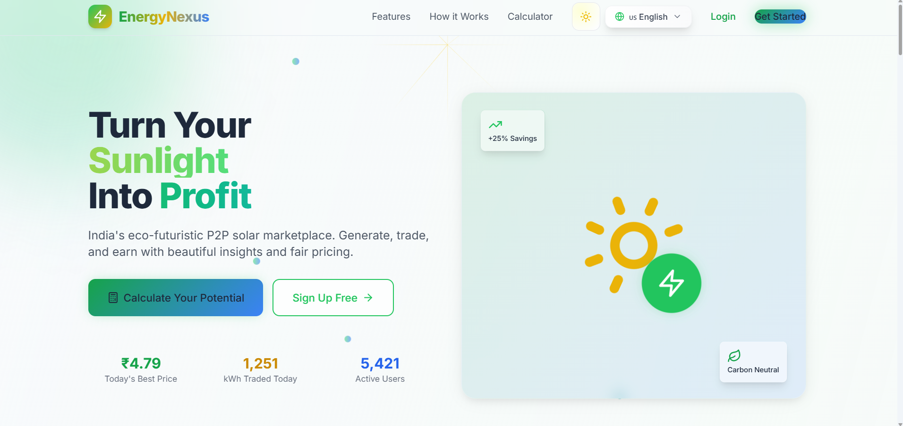
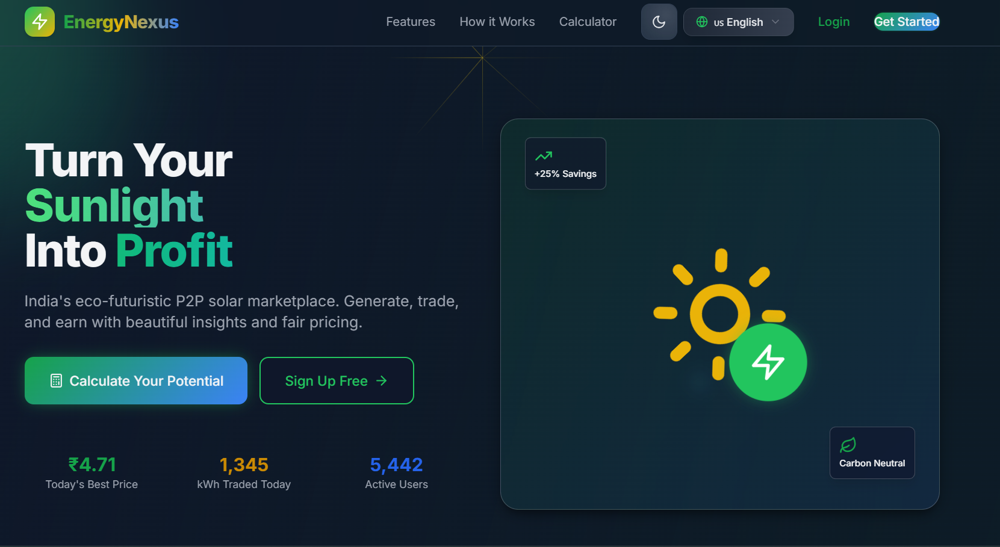
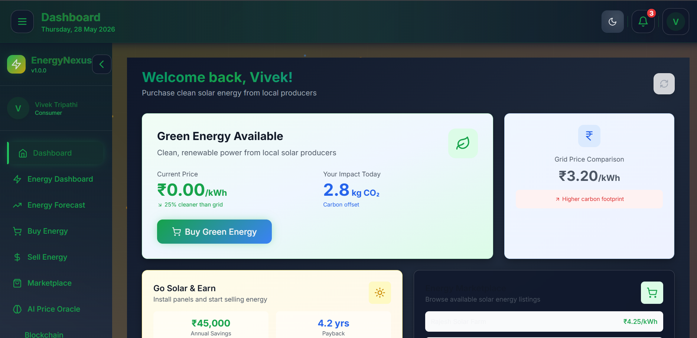
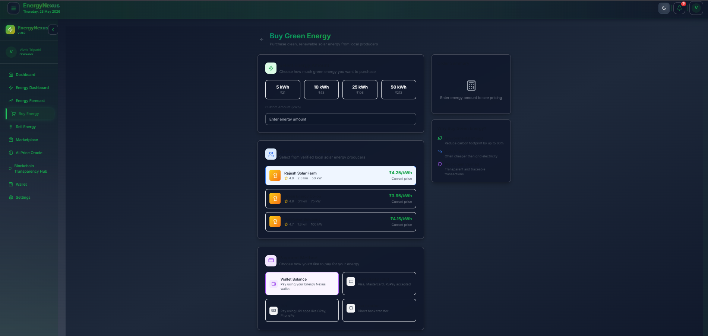
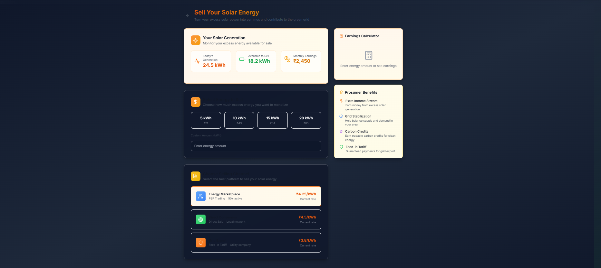

# ⚡ Energy-Nexus

Frontend-focused SIH prototype for peer-to-peer rooftop solar energy trading using AI and blockchain concepts.

---

## 🚀 Project Overview

Energy-Nexus is a Smart India Hackathon (SIH) project designed to create a decentralized platform where households and prosumers can trade excess rooftop solar  electrical energy directly with nearby consumers.

The project focuses on building a transparent, intelligent, and user-friendly energy marketplace that encourages clean energy adoption and efficient utilization of renewable resources.

---

## 💡 Problem Statement

Traditional electricity systems do not provide an efficient mechanism for small-scale solar producers to sell excess electricity directly to consumers.

As rooftop solar adoption increases, there is a growing need for:
- decentralized energy trading
- transparent pricing
- real-time energy monitoring
- intelligent energy management systems

Energy-Nexus aims to address these challenges through a digital peer-to-peer energy trading platform.

---

## 🌍 Project Vision

Energy-Nexus proposes a future where:

- Prosumers can sell surplus solar energy
- Consumers can purchase clean energy locally
- AI helps optimize pricing and forecasting
- Blockchain concepts improve transaction transparency
- Renewable energy trading becomes accessible and efficient

---

## ✨ Key Features

### 🔹 User Authentication
- Secure login/signup system
- Role-based access (Consumer / Prosumer)

### 🔹 Energy Marketplace
- Buy and sell excess rooftop solar energy
- Transparent energy trading workflow
- Real-time marketplace interface

### 🔹 Analytics Dashboard
- Energy consumption insights
- Trading statistics and analytics
- Earnings and savings visualization

### 🔹 Smart Energy System
- AI-based future scope for price prediction
- Weather forecasting integration
- Smart recommendation system

### 🔹 Modern Frontend UI
- Responsive dashboard design
- Interactive components
- Mobile-friendly interface
- Clean user experience

---

## 🛠️ Tech Stack

### Frontend
- React
- TypeScript
- Vite
- Tailwind CSS
- Framer Motion

### Backend (Planned)
- Node.js
- Express.js
- MongoDB

### Future Integrations
- Blockchain verification
- AI-based forecasting
- Real-time trading engine

---

## 📸 Screenshots

### Landing Page



### Dashboard


### Marketplace


### Analytics


---

## 🏗️ Project Structure

```text
Energy-Nexus/
│
├── frontend/          # Frontend application
├── backend/           # Planned backend integration
├── docs/              # Project documentation
├── screenshots/       # Project screenshots
└── README.md
```

---

## 🖥️ Current Project Status

This project is currently in frontend prototype and system design stage.

### Implemented
- Frontend UI development
- Marketplace dashboard
- Responsive layouts
- Energy trading workflow design
- Analytics interface

### Planned
- Backend API integration
- Blockchain transaction layer
- AI-based energy prediction
- Real-time energy exchange
- Wallet and payment integration

---

## 🔮 Future Scope

Planned future enhancements include:

- Real-time peer-to-peer energy trading
- AI-powered price prediction
- Smart weather forecasting integration
- Blockchain-secured transactions
- Digital wallet integration
- Smart grid analytics
- IoT-based solar meter integration

---

## 👥 Team & SIH Context

Energy-Nexus was developed as a Smart India Hackathon (SIH) project focused on solving challenges in decentralized solar energy trading and sustainable energy management.

---

## ⚙️ Local Setup

### Clone Repository

```bash
git clone https://github.com/Vivek8840/Energy-Nexus.git
```

### Navigate to Frontend

```bash
cd Energy-Nexus/frontend
```

### Install Dependencies

```bash
npm install
```

### Run Development Server

```bash
npm run dev
```

---

## 📌 Repository Focus

This repository currently focuses on:
- frontend system design
- user experience
- energy trading workflow visualization
- scalable architecture planning

Backend and AI integrations are planned for future development.

---

⭐ Building innovative solutions for decentralized clean energy systems.